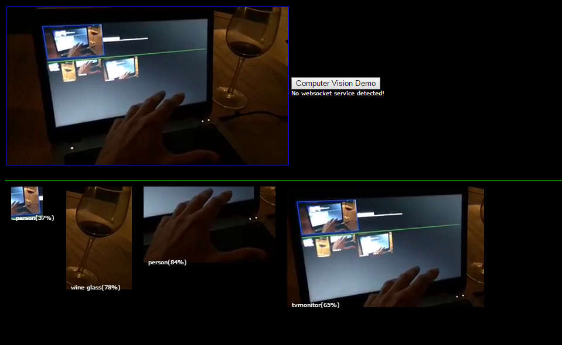

# Deep-CVision-Demo
Preservation of a fullstack demo for deep learning through mobile computer vision, processed in the cloud.  
I made this in the summer of 2017 as a live demonstration to be used in a deep learning presentation. 
The stack consisted of a modified **darknet/yolo v2** backend that streamed video through **ffmpeg**. 
A **nginx** webfront served **javascript** and **html** and used a **websocket service** written in **go** that coordinated the streaming. 
The input came from a **live video streaming** service called **bambuser**. 
I wrote a separate scraper in **perl** that dug out the raw livestream url. 
Sadly bambuser shut down their service in januari 2018.  
The service where also capable of multiplexing audio sent to **google speech** for text caption analyzed in the front. 
With this you could tell it to draw some colored objects and move them around through voice. 
It also had a feature to play the minions banana song when a banana showed up in the live stream. 
*( My kids loved that feature :smile: )*  
All this where set up on a p2xlarge **EC2** GPU instance in the **AWS** cloud.
  

 
The darknet files included are those I identified where changed.  
Changes I made to make it take raw piped image input and output json data including captions, bounding boxes for predictions and image data.
